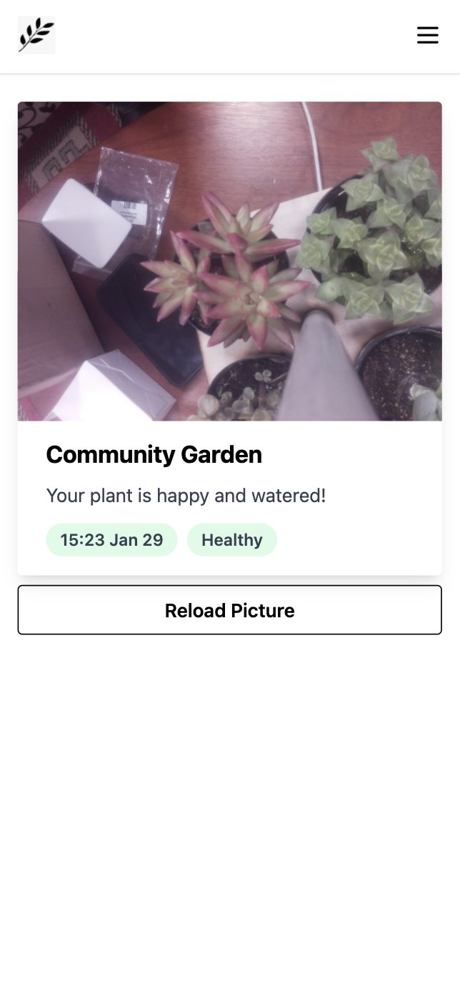
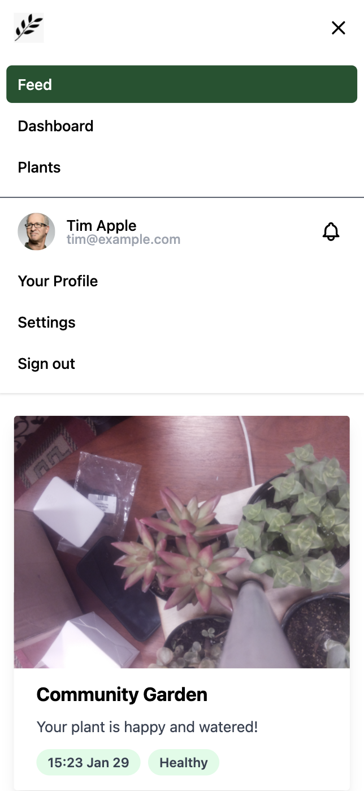

#  ComPost

 

ComPost is the first personal garden accessory that encourages users of all backgrounds to **actively engage** in a community involved with caring for plants.

As our technology advances as a society, we tend to lose ourselves and connections in the vast emptiness of the virtual world. Our product, ComPost, is an accessory consisting of a suite of sensors and a camera to actively monitor gardens and plants in order to create a sense of community among those interested in interacting with their green friends.

We aim to make plant care a **stress free and social catalyst** for all members of a shared community. Plant care and social interaction are considered an antidote to the everyday stresses we face with the busy, and ever changing tech infused world we live in.

**Preview this app live:**

|     Example Feed     |           Full            |
| :------------------: | :-----------------------: |
|  |  |
